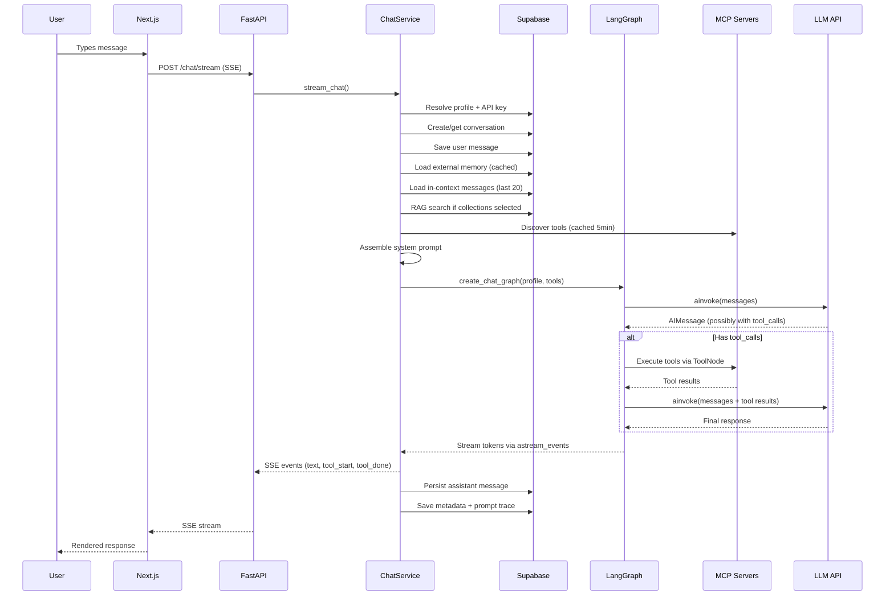
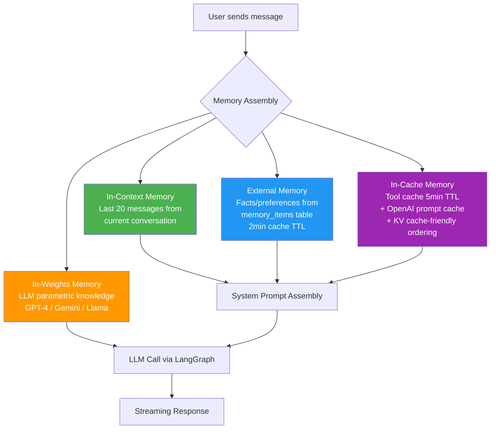
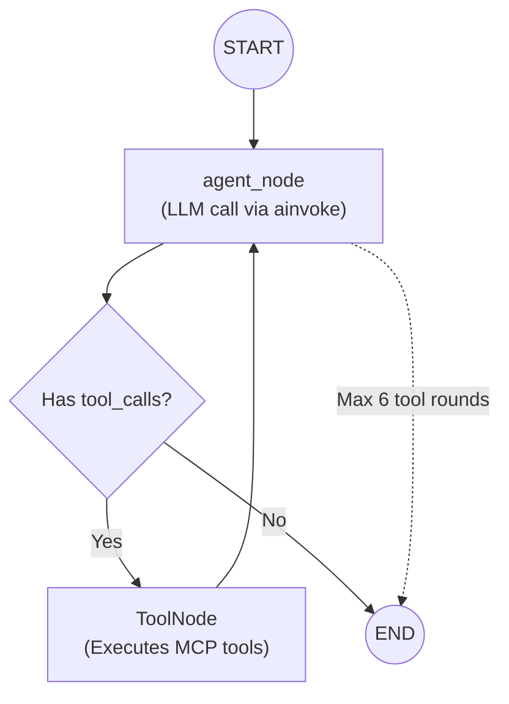
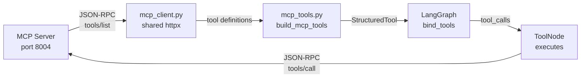
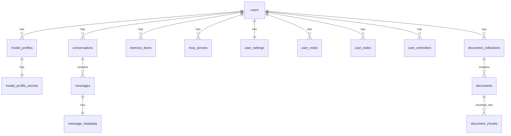

# CTS Backend — Complete Technical Documentation

> **Purpose:** Interview-ready deep dive into every backend component.
> Focus: LangGraph agents, tool-calling flow, all 4 memory types, MCP integration.

---

## Table of Contents

1. [Architecture Overview](#1-architecture-overview)
2. [The 4 Types of Agentic Memory (Deep Dive)](#2-the-4-types-of-agentic-memory)
3. [LangGraph Agent — Complete Flow](#3-langgraph-agent--complete-flow)
4. [MCP Tool Integration](#4-mcp-tool-integration)
5. [Streaming Pipeline](#5-streaming-pipeline)
6. [System Prompt Assembly](#6-system-prompt-assembly)
7. [Supabase & Database Layer](#7-supabase--database-layer)
8. [Authentication & Security](#8-authentication--security)
9. [Error Handling & Resilience](#9-error-handling--resilience)
10. [Interview Q&A](#10-interview-qa)

---

## 1. Architecture Overview

```
┌─────────────────────────────────────────────────────────────────────┐
│                        CTS Application                              │
│                                                                     │
│  ┌───────────────┐    SSE Stream    ┌─────────────────────────────┐ │
│  │   Next.js 14   │ ◄════════════► │     FastAPI Backend          │ │
│  │   (Frontend)   │   HTTP/REST     │     (Port 8000)             │ │
│  │   Port 3001    │ ═══════════════►│                             │ │
│  └───────────────┘                  │  ┌───────────────────────┐  │ │
│                                     │  │   ChatService          │  │ │
│                                     │  │   (Orchestrator)       │  │ │
│                                     │  │                       │  │ │
│                                     │  │  ┌─────────────────┐  │  │ │
│                                     │  │  │  LangGraph       │  │  │ │
│                                     │  │  │  StateGraph      │  │  │ │
│                                     │  │  │  agent → tools   │  │  │ │
│                                     │  │  │  → agent (loop)  │  │  │ │
│                                     │  │  └─────────────────┘  │  │ │
│                                     │  └───────────────────────┘  │ │
│                                     └──────────────┬──────────────┘ │
│                                                    │                │
│                            ┌───────────────────────┼────────┐       │
│                            │                       │        │       │
│                     ┌──────▼──────┐         ┌──────▼──────┐ │       │
│                     │  Supabase    │         │ MCP Servers  │ │       │
│                     │  (15 tables) │         │ (26 servers) │ │       │
│                     │  RLS + pgvec │         │ JSON-RPC     │ │       │
│                     └─────────────┘         └─────────────┘ │       │
│                                                             │       │
│                                              ┌──────────────┘       │
│                                              │                      │
│                                       ┌──────▼──────┐              │
│                                       │  LLM APIs    │              │
│                                       │  OpenAI      │              │
│                                       │  Gemini      │              │
│                                       │  Ollama      │              │
│                                       │  Groq, etc.  │              │
│                                       └─────────────┘              │
└─────────────────────────────────────────────────────────────────────┘
```

### Request Flow (Single Chat Message)



---

## 2. The 4 Types of Agentic Memory

This is the **core differentiator** of the project. All four standard memory types from the agentic AI literature are implemented.

### 2.1 In-Context Memory

> **Definition:** Information retained within the current conversation window — the messages the LLM can "see" right now.

**Implementation:** [chat_service.py:437-438](file:///c:/CTS/services/api/src/services/chat_service.py#L437-L438)

```python
MAX_CONTEXT_MESSAGES = 20  # line 36

# In stream_chat():
msg_rows = data.get_messages(conv_id, MAX_CONTEXT_MESSAGES + 1)
messages_for_llm = [{"role": r["role"], "content": r["content"]} for r in msg_rows]
```

**How it works:**
1. When a user sends a message, we fetch the **last 20 messages** from the current conversation from Supabase
2. These messages are passed directly to the LLM as the conversation history
3. The LLM can reference anything said in those 20 messages
4. The `+1` fetches 21 to ensure we have buffer for the system prompt

**Why 20?** Balances context quality vs. token cost. GPT-4 can handle more, but Ollama/Llama models have smaller context windows.

**Database query:** [chat_data_supabase.py:146-163](file:///c:/CTS/services/api/src/services/chat_data_supabase.py#L146-L163)
```python
def get_messages(self, conversation_id: str, limit: int = 50) -> list[dict]:
    r = (
        self.sb.table("messages")
        .select("role, content, created_at")
        .eq("conversation_id", conversation_id)
        .order("created_at", desc=False)  # chronological
        .limit(limit)
        .execute()
    )
```

**Interview answer:** *"In-context memory is the simplest — we load the last 20 messages from the current conversation and pass them as the conversation history to the LLM. The LLM naturally uses this context to maintain coherent multi-turn dialogue."*

---

### 2.2 External Memory

> **Definition:** Information that persists **across sessions** in an external store. The user can tell the AI "remember that I prefer Python" and it will recall this in a completely new conversation.

**Implementation:** Supabase `memory_items` table + [chat_service.py:421-434](file:///c:/CTS/services/api/src/services/chat_service.py#L421-L434)

```python
# Load external memory
memory_items = data.get_recent_memory(user_id, limit=10)

# Format and inject into system prompt
memory_context = "\n\n[External memory - from previous sessions]:\n"
for m in memory_items:
    memory_context += f"- [{m['kind']}] {m['text']}\n"
```

**Storage schema:** [001_initial_schema.sql:48-56](file:///c:/CTS/supabase/migrations/001_initial_schema.sql#L48-L56)
```sql
CREATE TABLE public.memory_items (
    id UUID PRIMARY KEY,
    user_id UUID NOT NULL REFERENCES auth.users(id),
    kind TEXT NOT NULL CHECK (kind IN ('summary', 'fact', 'preference')),
    text TEXT NOT NULL,
    source TEXT,  -- e.g., conversation_id or 'manual'
    embedding vector(1536)  -- for future semantic search
);
```

**Three memory kinds:**
| Kind | Example | When created |
|------|---------|-------------|
| `fact` | "User's name is Sanjay" | Agent saves during chat |
| `preference` | "User prefers dark mode" | Agent infers from conversation |
| [summary](file:///c:/CTS/mcp-servers/notes/server.py#181-206) | "Discussed project architecture" | End-of-conversation summary |

**How memories are created:**
1. **Manual:** User clicks "Save to Memory" in UI → `POST /memory` → [routers/memory.py](file:///c:/CTS/services/api/src/routers/memory.py)
2. **Automatic:** When `save_to_memory=True` in chat request → [chat_service.py:676-678](file:///c:/CTS/services/api/src/services/chat_service.py#L676-L678):
```python
if save_to_memory and to_persist:
    data.create_memory_item(user_id, memory_kind, to_persist[:500], conv_id)
```
3. **Via MCP Tools:** The Notes and Todo MCP servers store data in Supabase tables (`user_notes`, `user_todos`) which function as another layer of external memory

**How memories are used:** Injected into the system prompt as `[External memory - from previous sessions]` block. The LLM sees these facts and can reference them naturally.

**Interview answer:** *"External memory uses a `memory_items` table in Supabase with three kinds: facts, preferences, and summaries. When a user chats, we load their last 10 memory items and inject them into the system prompt as structured context. This lets the AI remember 'User prefers Python' across completely different sessions. Memories are created either manually by the user or automatically when the agent detects important facts."*

---

### 2.3 In-Weights Memory

> **Definition:** Knowledge that is "baked into" the model's parameters during pre-training. This is the model's inherent knowledge — it knows Python syntax, world history, etc. without any external lookup.

**Implementation:** No code needed — this is the LLM itself. But we **explicitly acknowledge it** in the system prompt:

```python
# chat_service.py:491-492
system_prompt = """You are a helpful AI assistant with agentic memory.
MEMORY: In-context (recent msgs), external (past sessions), in-weights (knowledge). 
Prefer tools for live data."""
```

**And in the model factory:** [model_factory.py](file:///c:/CTS/services/api/src/langgraph_services/model_factory.py)

The [create_chat_model_from_profile()](file:///c:/CTS/services/api/src/langgraph_services/model_factory.py#20-65) function supports multiple LLMs, each with different in-weights knowledge:

| Model | In-Weights Strength |
|-------|-------------------|
| GPT-4 / GPT-4o | Broad, up to training cutoff |
| Gemini 2.0 Flash | Google's latest knowledge |
| Llama 3.1 (Ollama) | Open-source, smaller knowledge base |
| Groq (Mixtral) | Fast inference, moderate knowledge |

**The system prompt tells the model:** *"Use your in-weights knowledge for general questions, but prefer tools for live/real-time data."* This prevents the model from hallucinating about current weather or stock prices when MCP tools like Weather or Stocks are available.

**Interview answer:** *"In-weights memory is inherent to the LLM — it's the knowledge encoded in model parameters during pre-training. We support multiple models (GPT-4, Gemini, Llama, Groq) via a unified model factory, each bringing different knowledge. We explicitly tell the model in the system prompt to use its parametric knowledge for general questions but prefer tools for real-time data, preventing hallucination."*

---

### 2.4 In-Cache Memory

> **Definition:** Efficient reuse of prior computation using KV cache or prompt caching. When the same prefix of tokens appears, the model/API can skip recomputing attention for those tokens.

**Implementation:** Two levels of caching:

#### Level 1: Application-level caching — [chat_service.py:42-62](file:///c:/CTS/services/api/src/services/chat_service.py#L42-L62)

```python
# Thread-safe KV caches
_cache_lock = threading.Lock()
_tool_list_cache: dict = {}   # MCP tools → 5 min TTL
_cache_ttl = 300
_memory_cache: dict = {}      # External memory → 2 min TTL
_memory_cache_ttl = 120

def _cache_get(cache: dict, key: str, ttl: int) -> tuple[bool, any]:
    """Thread-safe cache get. Returns (hit, value)."""
    with _cache_lock:
        entry = cache.get(key)
        if entry and (time.time() - entry["ts"]) < ttl:
            return True, entry["data"]
    return False, None
```

**What's cached and why:**

| Cache | Key | TTL | What | Why |
|-------|-----|-----|------|-----|
| `_tool_list_cache` | `tools:{server_id}` | 300s (5min) | MCP tool definitions | Avoids calling `tools/list` on every message |
| `_memory_cache` | `mem:{user_id}` | 120s (2min) | External memory items | Avoids DB query per message |

#### Level 2: OpenAI Prompt Caching — [model_factory.py:15-16](file:///c:/CTS/services/api/src/langgraph_services/model_factory.py#L15-L16)

```python
def _prompt_cache_key(prefix: str) -> str:
    """Stable key for OpenAI prompt caching. Same prefix = cache hit."""
    return f"cts_{hashlib.sha256(prefix.encode()).hexdigest()[:24]}"
```

When using OpenAI models, we generate a [prompt_cache_key](file:///c:/CTS/services/api/src/langgraph_services/model_factory.py#15-18) from the tool list. This tells OpenAI's API: "this prefix of the prompt is the same as last time — reuse the KV cache." This saves **50-90% of compute** for the static system prompt + tool definitions.

#### Level 3: System prompt ordering for KV cache coherence

```python
# chat_service.py:490-539 — System prompt assembly order:
# 1. Static system prompt (same every time) ← KV cache reuses this
# 2. Tool definitions (stable per session) ← KV cache reuses this
# 3. Variable: external memory (changes slowly) ← Sometimes cached
# 4. Variable: RAG results (changes per query) ← Never cached
```

**Why the order matters:** OpenAI/Gemini's KV cache works on **prefixes**. If you put the changing content first, nothing gets cached. By putting static content first and variable content last, the cache hit rate is maximized.

**Interview answer:** *"In-cache memory operates at three levels. First, application-level: we cache MCP tool lists (5min TTL) and external memory items (2min TTL) in thread-safe dictionaries with lock protection. Second, API-level: for OpenAI models, we generate a stable [prompt_cache_key](file:///c:/CTS/services/api/src/langgraph_services/model_factory.py#15-18) from the tool list hash, enabling OpenAI's server-side KV cache to skip recomputing attention for the system prompt prefix — saving 50-90% compute. Third, we order the system prompt with static content first and variable content last, maximizing KV cache prefix hits."*

---

### Memory Types Summary



**Debug output per message** — the frontend shows all memory indicators:
```json
{
  "type": "debug",
  "memory": {
    "in_context_messages": 12,
    "external_memory_items": 3,
    "memory_cache_hit": true,
    "tool_cache_hits": 2,
    "tools_available": 8,
    "tools_used": ["save_note"],
    "external_dbs_used": ["My Documents"],
    "rag_chunks_retrieved": 3
  }
}
```

---

## 3. LangGraph Agent — Complete Flow

### 3.1 What is LangGraph?

LangGraph is a **state machine framework** built on top of LangChain. It models the agent as a **directed graph** where:
- **Nodes** = functions that transform state (agent node, tool node)
- **Edges** = transitions between nodes (agent→tools, tools→agent, agent→END)
- **State** = the accumulated messages (uses `add_messages` reducer to append, not overwrite)

### 3.2 Graph Structure

File: [chat_graph.py](file:///c:/CTS/services/api/src/langgraph_services/chat_graph.py)



### 3.3 State Definition

```python
class GraphState(TypedDict):
    messages: Annotated[list[BaseMessage], add_messages]
```

The `add_messages` reducer means each node's output **appends** to the message list rather than replacing it. This is how tool results accumulate:

```
Round 1: [SystemMessage, HumanMessage] → agent → [AIMessage(tool_calls=[save_note])]
Round 2: [... + AIMessage + ToolMessage(result)] → agent → [AIMessage("Note saved!")]
```

### 3.4 Agent Node (The Brain)

```python
async def agent_node(state: GraphState) -> dict:
    messages = state.get("messages", [])
    response = await llm_with_tools.ainvoke(messages)  # async!
    
    # Ollama fallback: parse JSON tool calls from text
    if tools and not getattr(response, "tool_calls", None):
        parsed = _try_parse_tool_call_from_text(content_str, tool_name_map)
        if parsed:
            response = AIMessage(content="", tool_calls=[...])
    
    return {"messages": [response]}
```

**Key details:**
- Uses `ainvoke` (async) to avoid blocking the event loop
- `llm_with_tools = llm.bind_tools(tools)` — OpenAI/Gemini use native function calling
- **Ollama fallback:** Local models (Llama) don't support native tool calls. They output JSON as text like `{"name":"save_note","kwargs":{...}}`. The [_try_parse_tool_call_from_text()](file:///c:/CTS/services/api/src/langgraph_services/chat_graph.py#32-91) function parses 3 JSON formats and converts to proper `tool_calls`

### 3.5 Routing Logic

```python
MAX_TOOL_ROUNDS = 6

def _should_continue(state: GraphState):
    tool_count = sum(1 for m in messages if isinstance(m, ToolMessage))
    if tool_count >= MAX_TOOL_ROUNDS:
        return END  # Prevent infinite loops
    if last message has tool_calls:
        return "tools"
    return END
```

**Why cap at 6?** Llama 3.1 sometimes retries a failed tool call in a loop. Without the cap, it hits LangGraph's `recursion_limit=50` and raises `GraphRecursionError`.

### 3.6 Tool Node

```python
tool_node = ToolNode(tools)  # LangGraph prebuilt
```

`ToolNode` automatically:
1. Reads `tool_calls` from the last `AIMessage`
2. Invokes matching `StructuredTool` functions
3. Returns `ToolMessage` with results
4. These messages go back to the agent for the next round

### 3.7 Graph Compilation

```python
builder = StateGraph(GraphState)
builder.add_node("agent", agent_node)
builder.add_node("tools", tool_node)
builder.add_edge(START, "agent")
builder.add_conditional_edges("agent", _should_continue)
builder.add_edge("tools", "agent")
return builder.compile()
```

### 3.8 Graph Execution Tracing

File: [graph_tracer.py](file:///c:/CTS/services/api/src/langgraph_services/graph_tracer.py)

Every execution generates a **Mermaid flowchart** showing the exact path:

```
flowchart TD
    Start((Start))
    N1["Agent (LLM) round 1"]
    N2["🔧 save_note(title=Meeting, content=Discussion) → Saved note: Meeting"]
    N3["Agent (LLM) - final response"]
    Start --> N1
    N1 --> N2
    N2 --> N3
    N3 --> End((End))
```

This trace is stored in `message_metadata.prompt_trace` for visualization in the UI.

---

## 4. MCP Tool Integration

### 4.1 What is MCP?

**Model Context Protocol** — an open standard for connecting LLMs to external tools via JSON-RPC 2.0 over HTTP. Each MCP server exposes:
- **Tools:** Callable functions (e.g., [save_note](file:///c:/CTS/mcp-servers/notes/server.py#94-118), [get_weather](file:///c:/CTS/mcp-servers/weather/server.py#8-13))
- **Resources:** Data sources the model can read
- **Prompts:** Predefined prompt templates

### 4.2 How Tools Go From MCP → LLM



### 4.3 Tool Wrapping

File: [mcp_tools.py](file:///c:/CTS/services/api/src/langgraph_services/mcp_tools.py)

MCP tool definitions → LangChain `StructuredTool`:

```python
def build_mcp_tools(tools_with_server, data, user_id, conversation_id):
    for server_url, tool_def in tools_with_server:
        name = tool_def["name"]
        description = tool_def["description"]
        schema = tool_def.get("inputSchema", {})
        
        # Create async wrapper that calls MCP server
        async def call_fn(**kwargs):
            kwargs["user_id"] = user_id  # Inject context
            result = await data.call_tool(server_url, name, kwargs)
            return f"[TOOL_OUTPUT: {name}]\n{result}"
        
        tools.append(StructuredTool(
            name=name,
            description=description,
            func=call_fn,
            input_schema=schema
        ))
```

**Key features:**
- **User context injection:** Every tool call gets `user_id` and `conversation_id` automatically
- **Parameter aliasing:** Handles LLM naming variations (e.g., `note_title` → [title](file:///c:/CTS/services/api/src/services/chat_service.py#128-186))
- **Result formatting:** Prefixes output with `[TOOL_OUTPUT: name]` for graph tracer

### 4.4 26 Available MCP Servers

| Category | Servers |
|----------|---------|
| **Productivity** | Notes, Todo, Reminder, Calendar, Email |
| **Data/Tools** | Calculator, Search, Wikipedia, News, Stocks |
| **Travel** | Weather, Flight Booking, Hotel Booking, IRCTC Trains |
| **Utility** | Timezone, Translator, Unit Converter, Currency, QR Code |
| **Developer** | JSON Tools, Hash, UUID |
| **Communication** | WhatsApp Business, LinkedIn |
| **External** | Supabase (hosted), Jio Recharge |

---

## 5. Streaming Pipeline

### SSE Event Types

```typescript
// Frontend receives these event types:
{ type: "text",       content: "Hello! " }       // Token chunk
{ type: "tool_start", tool: "save_note" }         // Tool execution started
{ type: "tool_done",  tool: "save_note" }         // Tool execution completed
{ type: "debug",      memory: {...} }             // Memory indicators
{ type: "done",       conversation_id: "uuid" }   // Stream complete
{ type: "error",      content: "Rate limit..." }  // Error
```

### Streaming Implementation

```python
# chat_graph.py - Uses LangGraph's astream_events v2
async for event in graph.astream_events(
    {"messages": lc_messages},
    config={"recursion_limit": 50},
    version="v2",  # Latest event format
):
    if event["event"] == "on_chat_model_stream":
        # Token-by-token streaming from LLM
        yield {"data": json.dumps({"type": "text", "content": text})}
    elif event["event"] == "on_tool_start":
        yield {"data": json.dumps({"type": "tool_start", "tool": name})}
```

**Fallback:** If streaming produces no content (some models don't stream tools output), a full `ainvoke` is done to get the final response.

---

## 6. System Prompt Assembly

The system prompt is assembled in a specific order for **KV cache efficiency**:

```
┌─────────────────────────────────┐ ← Static (cached by KV)
│ 1. Base system prompt            │
│ "You are a helpful AI..."        │
├─────────────────────────────────┤
│ 2. Available resources           │ ← Semi-static
│ 3. Available prompts             │
├─────────────────────────────────┤
│ 4. Tool definitions              │ ← Stable per session (5min cache)
│ [TOOLS] save_note, list_notes... │
│ Tool hints + few-shot examples   │
├─────────────────────────────────┤ ← Variable (not cached)
│ 5. External memory               │
│ [fact] User prefers Python        │
├─────────────────────────────────┤
│ 6. RAG context                   │
│ Document chunks from collections  │
└─────────────────────────────────┘
```

**Why this order?** API-level prompt caching (OpenAI, Gemini) caches from the **beginning** of the prompt. Static content first = maximum cache reuse.

---

## 7. Supabase & Database Layer

### Schema: 15 Tables



### Data Access Pattern

Every service uses **Supabase REST API** (not direct SQL):

```python
r = self.sb.table("messages").select("role, content").eq("conversation_id", id).execute()
```

**Why REST not SQL?**
- Works without `DATABASE_URL` (Supabase may block direct connections)
- RLS policies enforced automatically
- No connection pool management needed

---

## 8. Authentication & Security

### JWT Verification (3-layer fallback)

File: [auth.py](file:///c:/CTS/services/api/src/auth.py)

```
Try 1: HS256 with SUPABASE_JWT_SECRET
    ↓ (fails)
Try 2: RS256 with JWKS from Supabase
    ↓ (fails)
Try 3: Validate via /auth/v1/user endpoint
    ↓ (fails)
Return 401 Unauthorized
```

---

## 9. Error Handling & Resilience

| Error | Handling |
|-------|---------|
| **LLM Rate Limit (429)** | [LLMRateLimitError](file:///c:/CTS/services/api/src/services/chat_service.py#22-28) with `retry_after_seconds` → UI shows countdown |
| **LangGraph Recursion** | Caught, returns user-friendly message |
| **MCP Server Down** | Skipped silently, other servers continue |
| **Ollama Not Running** | Specific error message with `ollama run` command |
| **New Chat Error** | Rollback: delete the just-created conversation |
| **Existing Chat Error** | Rollback: delete the just-saved user message |

---

## 10. Interview Q&A

### Q: "Explain the 4 types of agentic memory in your project."

**A:** *"We implement all four. **In-context memory** is the last 20 messages from the current conversation — standard sliding window. **External memory** uses a `memory_items` table in Supabase storing facts, preferences, and summaries that persist across sessions — injected into the system prompt. **In-weights memory** is the LLM's parametric knowledge — we support GPT-4, Gemini, Llama via a unified model factory. **In-cache memory** operates at three levels: app-level TTL caches for tool lists and memory items, OpenAI prompt cache keys for server-side KV reuse, and strategic system prompt ordering putting static content first for maximum cache hits."*

### Q: "How does your LangGraph agent work?"

**A:** *"We use a `StateGraph` with an `add_messages` reducer. Two nodes: [agent](file:///c:/CTS/services/api/src/langgraph_services/chat_graph.py#155-178) (calls the LLM) and [tools](file:///c:/CTS/services/api/src/routers/mcp.py#66-75) (executes MCP tools). The agent node uses `ainvoke` asynchronously, and if the LLM returns `tool_calls`, the conditional edge routes to the ToolNode. After tool execution, results flow back to the agent for a final response. We cap at 6 tool rounds to prevent infinite loops, and support Ollama's JSON-in-text tool calls via a 3-format parser."*

### Q: "How do you handle multiple LLM providers?"

**A:** *"Our [model_factory.py](file:///c:/CTS/services/api/src/langgraph_services/model_factory.py) takes a profile dict with `api_style`, `provider_base_url`, `model_name`, and [api_key](file:///c:/CTS/services/api/src/config.py#53-56). For Gemini, it creates `ChatGoogleGenerativeAI`. For everything else (OpenAI, Groq, Ollama, OpenRouter), it creates `ChatOpenAI` — since they all follow the OpenAI API format. Both get `max_retries=2` for resilience."*

### Q: "How does MCP integration work?"

**A:** *"26 MCP servers expose tools via JSON-RPC 2.0 over HTTP. At chat time, we discover tools via `tools/list`, wrap them as LangChain `StructuredTool` objects (in [mcp_tools.py](file:///c:/CTS/services/api/src/langgraph_services/mcp_tools.py)), bind them to the LLM via `bind_tools()`, and execute via LangGraph's `ToolNode`. The tool node calls `tools/call` on the MCP server. We cache tool lists for 5 minutes and use a shared `httpx.AsyncClient` for connection reuse."*

### Q: "How does streaming work?"

**A:** *"The frontend establishes an SSE connection to `POST /chat/stream`. The backend uses LangGraph's `astream_events` v2 to get token-level events from the LLM. Each token chunk is wrapped as `{type: 'text', content: '...'}` and streamed. Tool start/end events are streamed too, so the UI shows real-time tool execution. After the stream completes, we persist the message and emit debug metadata."*

### Q: "What happens when Ollama doesn't support tool calling?"

**A:** *"We maintain a list of tool-capable Ollama models (llama3.1+, qwen3, mistral-nemo). If the model doesn't support tools, we disable MCP integration and tell the user to switch models. For models that do support tools but use text-based output (not native function calling), we parse JSON from the response using a 3-format parser that handles `{name, kwargs}`, `{function, ...}`, and `{tool, args}` formats."*

### Q: "How do you prevent the agent from looping infinitely?"

**A:** *"Two safeguards. First, `MAX_TOOL_ROUNDS = 6` — we count `ToolMessage` instances in state and force `END` when exceeded. Second, LangGraph's `recursion_limit=50` catches deeper loops. If a `GraphRecursionError` occurs, we catch it and return a user-friendly message instead of a stack trace."*

### Q: "How is data secured?"

**A:** *"Row Level Security (RLS) on every table ensures users only see their own data even if the API has a bug. JWTs are verified with a 3-layer fallback (HS256, RS256/JWKS, endpoint validation). API keys are stored per-user in `model_profile_secrets`. The backend uses a service role key to bypass RLS when needed, but all user-facing queries go through RLS."*

### Q: "What's the RAG pipeline?"

**A:** *"Users upload documents to collections. [document_service.py](file:///c:/CTS/services/api/src/services/document_service.py) chunks text into segments, generates OpenAI embeddings (text-embedding-3-small, 1536 dims), and stores them in `document_chunks` with a pgvector column. At query time, we generate an embedding for the user's message, call `match_document_chunks` (a Supabase RPC for vector cosine similarity), and inject the top-5 chunks into the system prompt as RAG context. We have an HNSW index for fast similarity search."*

### Q: "How do you handle caching efficiently?"

**A:** *"Thread-safe dictionaries with a global `threading.Lock`. Each cache entry stores `{data, timestamp}`. On read, we check if `now - timestamp < TTL`. Tool lists get 5-minute TTL (tools don't change often), memory items get 2-minute TTL (might be updated by another tool call). The lock prevents race conditions in async concurrent requests."*
