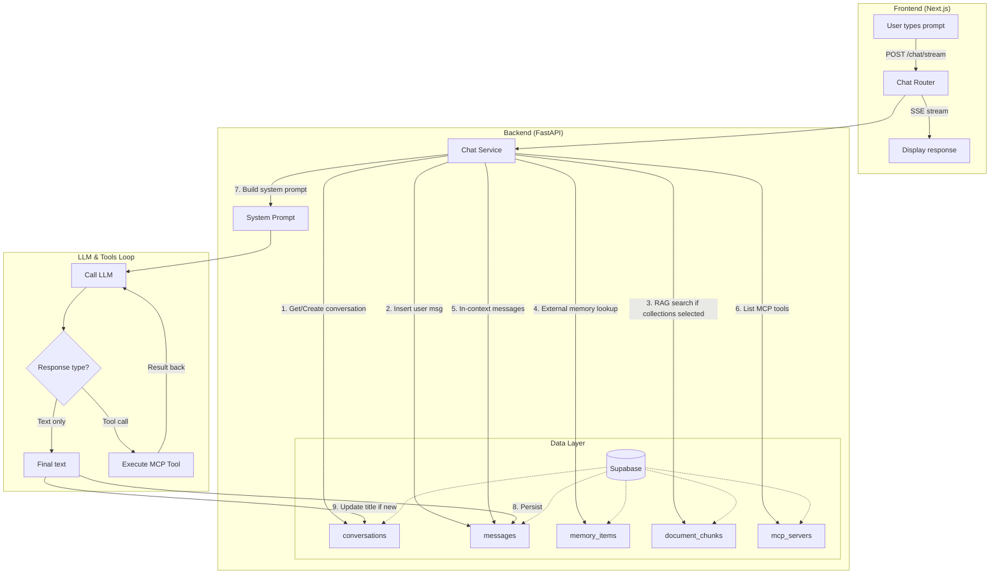

# CTS Prompt Flow Visualization

How your prompt travels through the system: tools, memory, RAG, and back to the LLM until the final output.

> **Note:** CTS uses LangChain + LangGraph for model abstraction and tool-calling. The flow below describes the request lifecycle. Each assistant message stores a **prompt trace** you can view in chat—click "View trace" under any AI response to see model, RAG chunks, memory items, tools used, and system prompt preview.

---

## High-Level Flow (Mermaid)



---

## Detailed Prompt Lifecycle

```
┌─────────────────────────────────────────────────────────────────────────────────┐
│  1. USER SENDS PROMPT                                                             │
└─────────────────────────────────────────────────────────────────────────────────┘
         │
         ▼
┌─────────────────────────────────────────────────────────────────────────────────┐
│  2. BACKEND: Resolve profile (API key, provider URL, model)                      │
│     → Get or create conversation in Supabase                                     │
│     → Insert user message into messages table                                     │
└─────────────────────────────────────────────────────────────────────────────────┘
         │
         ▼
┌─────────────────────────────────────────────────────────────────────────────────┐
│  3. CONTEXT ASSEMBLY (all fed into system prompt)                                 │
│     • RAG: If user selected collections → search document_chunks by embedding   │
│     • External memory: Last 10 memory_items (summary/fact/preference)              │
│     • In-context: Last 20 messages from this conversation                         │
│     • Tools: List from all user's MCP servers (tools/list)                         │
│     • Resources & Prompts: Optional from MCP servers                               │
└─────────────────────────────────────────────────────────────────────────────────┘
         │
         ▼
┌─────────────────────────────────────────────────────────────────────────────────┐
│  4. LANGGRAPH AGENT                                                              │
│     • Model: LangChain ChatOpenAI or ChatGoogleGenerativeAI (from model_factory)  │
│     • Tools: MCP tools wrapped as LangChain StructuredTools (mcp_tools)           │
│     • agent node: llm.bind_tools(tools).invoke(messages)                          │
└─────────────────────────────────────────────────────────────────────────────────┘
         │
         ├─── If response is plain text ────────────────────────────────────────────►│
         │                                                                          │
         └─── If AIMessage has tool_calls ───────────────────────────────────────────┤
                    │                                                                │
                    ▼                                                                │
┌─────────────────────────────────────────────────────────────────────────────────┐  │
│  5. LANGGRAPH TOOLS NODE (ToolNode)                                               │  │
│     • Route to tools node when AIMessage.tool_calls is non-empty                 │  │
│     • ToolNode invokes each tool → ChatDataSupabase.call_tool(server_url, ...)    │  │
│     • POST {server_url}/mcp → tools/call JSON-RPC                                 │  │
│     • ToolMessage(s) appended → agent node runs again                             │  │
│     • Recursion limit 25 until model returns text-only                            │  │
└─────────────────────────────────────────────────────────────────────────────────┘  │
                    │                                                                │
                    └────────────────────────────────────────────────────────────────┘
         │
         ▼
┌─────────────────────────────────────────────────────────────────────────────────┐
│  6. SUCCESS: Persist & Stream                                                    │
│     • Insert assistant message into messages                                     │
│     • Save message_metadata (tools_used, external_dbs_used)                      │
│     • If new conversation: update title from first prompt (first 50 chars)       │
│     • Optional: create memory_item if "Save to memory" was checked                │
│     • Stream done event with conversation_id                                      │
└─────────────────────────────────────────────────────────────────────────────────┘

┌─────────────────────────────────────────────────────────────────────────────────┐
│  ON ERROR (rate limit 429, API key invalid, etc.):                                │
│     • If this was a new conversation → delete it (and cascade messages)          │
│     • Do NOT save to Supabase → won't appear in sidebar on refresh               │
│     • Stream error event to frontend                                              │
└─────────────────────────────────────────────────────────────────────────────────┘
```

---

## Tools Used Per Request

| Component        | Tool/Action                     | Purpose                                    |
|-----------------|----------------------------------|--------------------------------------------|
| **Supabase**    | REST API                          | conversations, messages, memory_items, mcp_servers |
| **Model Factory** | `create_chat_model_from_profile` | LangChain ChatOpenAI / ChatGoogleGenerativeAI |
| **MCP Tools**  | `build_mcp_tools`                  | MCP → LangChain StructuredTools            |
| **LangGraph**   | StateGraph, ToolNode               | agent ↔ tools loop, tool execution         |
| **MCP Servers** | `tools/list`, `tools/call`         | List tools, execute tool                   |
| **Document Service** | `search_collections`        | RAG search over document_chunks             |
| **Profile Service**  | `get_profile_with_api_key`   | Resolve API key for LLM                     |

---

---

## Flow Summary

This doc describes the **prompt lifecycle** from user input to final response:

1. **Request** → Chat router receives the prompt.
2. **Context** → RAG, memory, in-context messages, MCP tools are assembled into the system prompt.
3. **LangGraph** → Agent node calls the model with `bind_tools`; if the model returns tool_calls, ToolNode executes them and loops back.
4. **Persistence** → Final assistant message and metadata are saved; SSE streams events to the frontend.

See [TOOL_EXECUTION_FLOW.md](TOOL_EXECUTION_FLOW.md) for tool-specific flow.

---

## Contribution – Editing the Prompt Flow

| Change | Where to edit |
|--------|----------------|
| RAG chunks in context | `chat_service.py` – RAG search, system prompt assembly |
| Memory items count | `chat_service.py` – `MAX_EXTERNAL_MEMORY_ITEMS` |
| In-context message limit | `chat_service.py` – `MAX_CONTEXT_MESSAGES` |
| System prompt format | `chat_service.py` – `_build_system_prompt()` |
| SSE event types | `chat_graph.py` – `stream_chat_with_graph()` |

---

## Example: "What time is it in Tokyo?"

```
User prompt
    → ChatService gets user's MCP servers (Timezone on :8005)
    → mcp_tools.build_mcp_tools() creates StructuredTool for get_time_in_timezone
    → LangGraph agent: llm.bind_tools([get_time_in_timezone, ...]).invoke(messages)
    → Model returns AIMessage with tool_calls: [get_time_in_timezone(timezone="Asia/Tokyo")]
    → ToolNode invokes tool → data.call_tool() → MCP tools/call
    → MCP server returns "2025-03-21 14:30:00 JST"
    → ToolMessage injected → agent runs again
    → Model generates final answer: "It's 2:30 PM in Tokyo..."
    → Assistant message persisted, tools_used=["get_time_in_timezone"]
```
